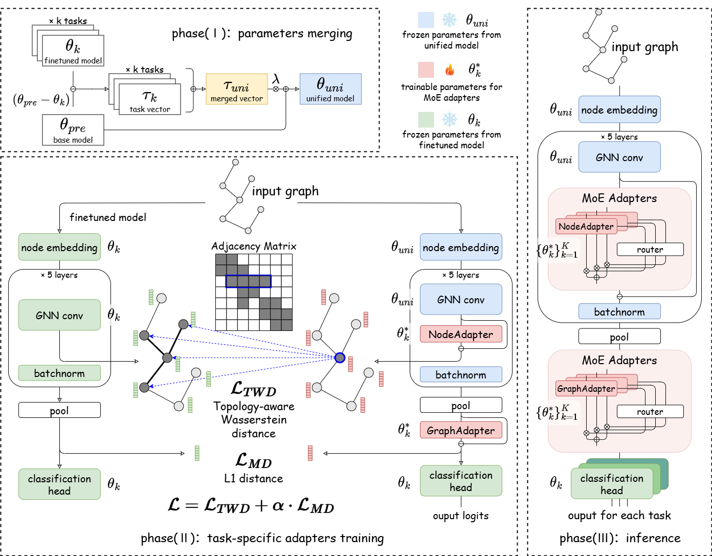

# G-Merging

Code of Paper: "G-Merging: Graph Models Merging for Parameter-Efficient Multi-Task Knowledge Consolidation". [ICLR 2026]

**Keywords**: Model Merging, Parameter Efficient Fine-Tuning, Multi-task Learning

## Abstract

The pretrain-finetuning paradigm has achieved notable success in graph learning. Moreover, merging models fine-tuned on different tasks to enable a parameter-efficient model with multi-task capabilities is gaining increasing attention for its practicality. However, existing model merging methods, such as weight averaging and task arithmetic, struggle to generalize well to graph structures and Graph Neural Network (GNN) models due to the unique structural heterogeneity of graph data. In this paper, we propose an innovative graph model merging framework called G-Merging for merging multiple task-specific fine-tuned GNN models. G-Merging first employs task arithmetic to coarsely merge graph models, capturing shared cross-task knowledge. Second, it introduces a Topology-aware Wasserstein Distance (TWD) loss to train lightweight task adapters, preserving domain-specific graph patterns via aligning the embeddings of merged and fine-tuned models. Third, G-Merging integrates the adapters into a training-free, topology-aware router within a mixture-of-experts (MoE) architecture, dynamically routing input graphs to task-specific adapters based on structural similarity, thereby mitigating conflicts and enhancing knowledge sharing. Extensive experiments on 8 graph downstream datasets demonstrate the effectiveness of G-Merging, showing impressive performance close to or exceeding individual finetuned models while improving parameters and training efficiency.

## Framework




## Dependency
We used Python 3.10.16, PyTorch 2.5.1, PyTorch Geometric 2.6.1. For the Python packages, please see requirements.txt.

```
numpy==1.26.3
pandas==2.2.3
pillow==11.0.0
scipy==1.15.2
rdkit==2022.3.3
torch==2.5.1+cu121
torch-geometric==2.6.1
torch_cluster==1.6.3+pt25cu121
torch_scatter==2.1.2+pt25cu121
torch_sparse==0.6.18+pt25cu121
torch_spline_conv==1.2.2+pt25cu121
torchaudio==2.5.1+cu121
torchvision==0.20.1+cu121
```
## Preliminaries
We provide the `.pt` and `.pth` files of both pre-trained GNN models and fully fine-tuned models in the directory `./models`. You can directly utilize them without costly training or fine-tuning.

The datasets we use are in the directory `./data`, containing the raw SMILES representations of molecules.


## Run the code
For evaluating our method **G-Merging**, please simply run the following command to get started with different GNN backbones.
```
python G_Merging.py --device_no=0 --gnn_type gin --pretrain_strategy contextpred
python G_Merging.py --device_no=0 --gnn_type gin --pretrain_strategy edgepred
python G_Merging.py --device_no=0 --gnn_type gcn --pretrain_strategy contextpred
```
After the processing, the trained task-specific adapters will be saved in `./results/{pretrained}/adapters`, and the test results are recorded in `./results/{pretrained}/G_Merging.txt`.

You can also run the script:
```
bash G_Merging.sh
```

For evaluating the baseline methods, please simply run the following command:
```
python multitask_learning.py --device_no=0 --gnn_type gin --pretrain_strategy contextpred
python pretrain_finetuned.py --device_no=0 --gnn_type gin --pretrain_strategy contextpred
python task_arithmetic.py --device_no=0 --gnn_type gin --pretrain_strategy contextpred --merge weights_average
python task_arithmetic.py --device_no=0 --gnn_type gin --pretrain_strategy contextpred --merge task_arithmetic
python task_arithmetic.py --device_no=0 --gnn_type gin --pretrain_strategy contextpred --merge ties_merge
python task_arithmetic.py --device_no=0 --gnn_type gin --pretrain_strategy contextpred --merge emr_merge
python Ada_Merging.py --device_no=0 --gnn_type gin --pretrain_strategy contextpred
python Twin_Merging.py --device_no=0 --gnn_type gin --pretrain_strategy contextpred
```
The above Python scripts are located in the directory `./expe/baseline/` and need to be moved to the project root directory `./`  before execution.


